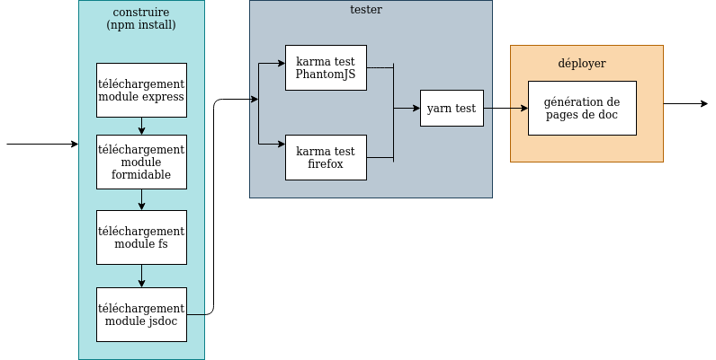

# Tectonic Plates

Le projet consiste à un affichage d'un globe Worldwind sur lequel peuvent être afficher au choix les jsons contenant les plaques tectoniques avec leur axe de rotation (modélisé par un segment orthogonal à la surface de la terre). 

L'intégration suit les étapes suivantes :

